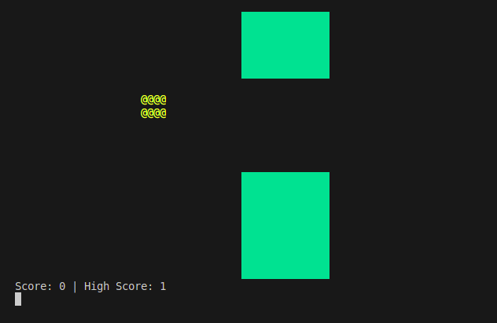
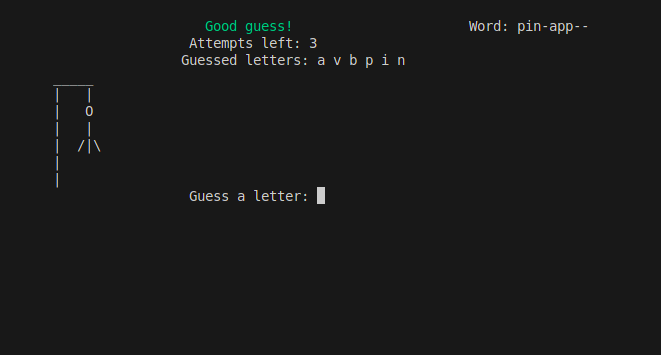
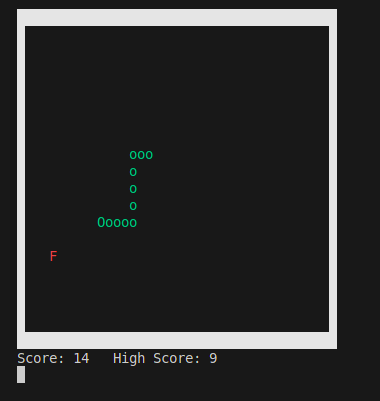
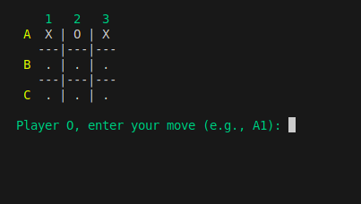
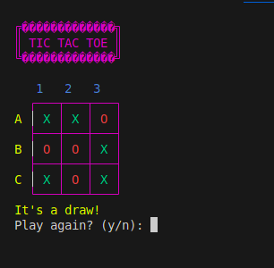

# 🎮 Terminal Game Collection in C++

Welcome to a collection of classic terminal-based games written in C++! Each game is implemented using basic C++ without external libraries (unless noted), designed to run directly in the terminal.

This is a fun project to learn C++ logic, control structures, and basic terminal I/O.

---

## 🕹️ Games Included

### 1. 🐦 Flappy Bird (ASCII)
- **Path**: `flappybrdgame/flappybird.cpp`
- **Screenshot**:

  

> An ASCII adaptation of Flappy Bird. Control the bird using the keyboard and avoid pipes as long as possible.

---

### 2. 🔤 Hangman
- **Path**: `hangmangame/hangmangame.cpp`
- **Screenshot**:

  

> Guess the word letter-by-letter before the full hangman figure appears. Includes word list and simple visuals.

---

### 3. 🐍 Snake Game
- **Path**: `snakegame/snakegame.cpp`
- **Screenshot**:

  

> Classic snake game in the terminal. Navigate the snake with arrow keys, eat food, and avoid crashing into yourself!

---

### 4. ❌⭕ Tic Tac Toe
- **Directory**: `ticktaktoe/`
- **Modes**:
  - **Player vs Player**: `ticktaktoe.cpp`
  - **Player vs AI**: `aigame.cpp`

#### Screenshots:
- **PvP**  
  

- **Player vs AI**  
  

> Enjoy a game of Tic Tac Toe against a friend or challenge the basic AI opponent. Fully interactive and played in the terminal.

---

## 🚀 How to Compile and Run

You need a C++ compiler like `g++`. If you're on Linux/macOS, you likely already have it installed. On Windows, you can use [MinGW](http://www.mingw.org/) or [WSL](https://learn.microsoft.com/en-us/windows/wsl/).

### Compile a Game
```bash
g++ path/to/file.cpp -o outputname
````

### Example: Run Snake Game

```bash
g++ snakegame/snakegame.cpp -o snake
./snake
```

Repeat similarly for each game:

| Game              | Compile Command                                  |
| ----------------- | ------------------------------------------------ |
| Flappy Bird       | `g++ flappybrdgame/flappybird.cpp -o flappybird` |
| Hangman           | `g++ hangmangame/hangmangame.cpp -o hangman`     |
| Snake             | `g++ snakegame/snakegame.cpp -o snake`           |
| Tic Tac Toe (PvP) | `g++ ticktaktoe/ticktaktoe.cpp -o tictactoe_pvp` |
| Tic Tac Toe (AI)  | `g++ ticktaktoe/aigame.cpp -o tictactoe_ai`      |

---

## 📁 Project Structure

```
.
├── flappybrdgame/
│   └── flappybird.cpp
├── game_screenshot/
│   ├── flabird.png
│   ├── hangman.png
│   ├── snakegame.png
│   ├── pvcticktacktoe.png
│   └── pvpticktaktoe.png
├── hangmangame/
│   └── hangmangame.cpp
├── snakegame/
│   └── snakegame.cpp
├── ticktaktoe/
│   ├── aigame.cpp
│   └── ticktaktoe.cpp
└── Readme.md
```

---

## 📦 Dependencies

Most games are self-contained. No external libraries are required except a standard C++ compiler.

⚠️ Some games may use special terminal features (like arrow key input). These may behave differently depending on your OS or terminal emulator. If you face input issues, try running in a Linux terminal or WSL.

---

## 📜 License

This project is licensed under the MIT License. Feel free to use, modify, and share!

---

## 🤝 Contributing

Want to improve these games or add more? Contributions are welcome! Feel free to fork the repo and submit a pull request.

---

## 🌟 Show Your Support

If you like this project, consider ⭐ starring the repository — it helps more people discover it!

---
